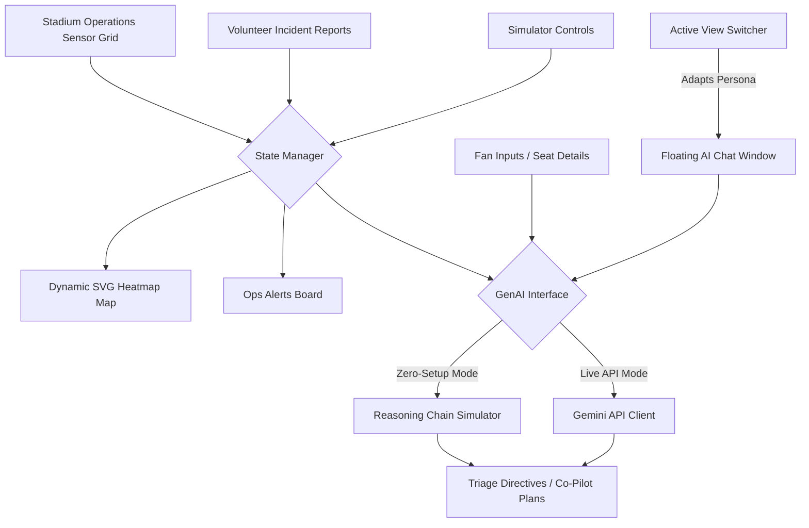

# StadiumPulse 2026 - GenAI Stadium Operations & Fan Experience Command Hub

StadiumPulse 2026 is a premium, GenAI-enabled stadium operations and fan experience dashboard designed for the FIFA World Cup 2026™. Built with raw HTML5/CSS3/ES6 and glassmorphic designs, the application streamlines event operations and enhances spectator safety, transit coordination, and environmental sustainability.

---

## 🌟 Key Features

1. **⚽ Fan Experience Portal**
   - **AI-Optimized Route Transit Planner:** Connects with live public transport updates to map transit times and estimate eco-savings.
   - **Adaptive Dynamic Wayfinder:** Computes step-by-step pedestrian paths inside the stadium, dynamically routing fans away from heavily congested stands.
   - **Green Fan Challenge:** Gamifies sustainability by tracking actions like recycling and transit use, awarding custom badges.
   - **Multilingual AI Concierge:** Real-time chatbot guide adjusting context dynamically to serve fans in English, Spanish, French, German, and Portuguese.

2. **📋 Staff & Volunteer Hub**
   - **AI Triage Dispatch Desk:** Logs field incidents (safety hazards, congestion, medical incidents) and automatically triages them by severity, generating volunteer response directives.
   - **PA Announcement Generator:** Instantly translates and crafts crowd management scripts in 6+ target languages with custom tone settings.

3. **🚨 Operations Command Center**
   - **Interactive Live Map:** High-fidelity SVG layout of the stadium stands and entry gates, shifting colors in real-time to represent spectator density (heatmap) and wait times.
   - **Operations Crisis Simulator:** Trigger crowd exit rushes, scanner failures, or food hub blockages to observe AI load-balancing advice.
   - **GenAI Co-Pilot Advisor:** Suggests tactical resource shifts (shuttle re-allocation, volunteer redirects) in response to active sensor data.

---

## 🏗️ Architectural Workflow



---

## ⚙️ Configuration & API Integration

StadiumPulse 2026 operates in two distinct execution modes:

- **Zero-Setup Mock Mode (Default):** Runs a smart, client-side reasoning engine showing the AI's "thought processes" and localized outputs. No API keys or backend servers required.
- **Live Gemini Mode:** Open the settings gear (⚙️) in the top-right header and enter a standard Google Gemini API key. The application will connect directly to `gemini-1.5-flash` to process wayfinding, incident triage, and concierge messages live.

---

## 🚀 How to Run Locally

Since this is a client-side micro-app, it requires no backend or build compilation step:

1. Clone the project workspace.
2. Open `index.html` in any web browser.
3. *(Optional)* Serve it via a local Python server:
   ```bash
   python -m http.server 3000
   ```
4. Navigate to `http://localhost:3000` in your web browser.
